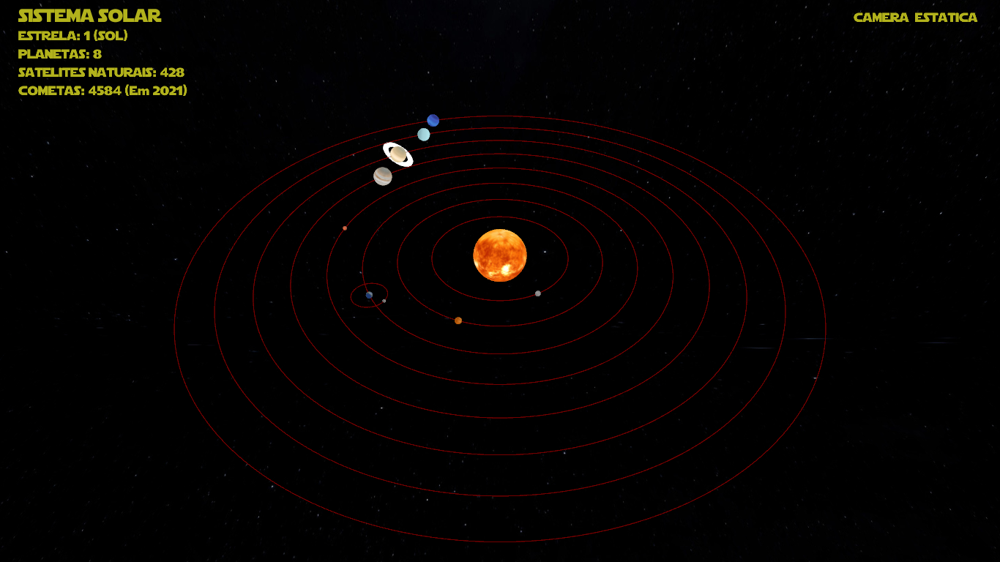

## Projeto desenvolvido para a disciplina de Computação Gráfica - Sistema Solar em 3D

**Docente:** Iális Cavalcante.

**Discentes:** Maria Eline - Maria Gabriele - Mariana Teixeira - Maxela Martins - Najala Kelly Lima - Nicole Fernandes.

**Bibliotecas  e APIs Utilizadas:**
* [OpenGL](https://www.opengl.org/) -  API de gráficos 3D.
* [GLAD](https://glad.dav1d.de/) - Language: C/C++, Specification: OpenGL,
Profile: Core.
* [GLFW](https://www.glfw.org/) - Utilizado para criar janelas, contextos e superfícies, além de receber entradas e eventos.
* [FREETYPE](https://www.freetype.org/) - Usado para renderizar fontes.
* [GLM](https://glm.g-truc.net/0.9.9/index.html) - Biblioteca de Matemática .

**Recursos Implementados:**
  
      O projeto foi desenvolvido utilizando o Visual Studio 2019. Na pasta principal existe uma arquivo executável sistemaSolar.exe, que foi gerado para computadores com suporte a SO de x64. A linguagem escolhida para o desenvolvimento do projeto foi C++.

 
       Sol, Lua e Planetas - Sistema com Objeto no centro e os outros orbitando ao seu redor.
 
       Câmeras -  Duas câmeras foram implementadas, a primeira que inicia com o projeto é a câmera estática e a segunda é executada ao se selecionar um planeta(Câmera Planetas) onde também aparece algumas informações sobre o planeta selecionado. Para volta para a primeira câmera utiliza-se a tecla space.
        

   
      Skybox - Utilizada na criação do plano de fundo, para conseguir um efeito de profundidade na cena.
        

  
       Movimento de Câmera - É possível  movimentar pela cena através das teclas 'w', 's', 'a' e 'd'

**Comandos:**
 * Scroll do Mouse ou movimento de "pinça no touchpad"  - Aplica zoom na cena.
 * Teclas 1 a 8 - Seleciona os planetas na ordem Mercúrio, Vênus, Terra, Marte, Saturno, Urano e Netuno respectivamente.
 * Teclas W,S,A e D - Movimenta a câmera no Modo Estático.

**Link para o repositório do projeto no Github:** https://github.com/ElineFarias/ProjetoSistemaSolar.git

**Link do video de Demonstração:** https://youtu.be/0eiLlNwEeRA

**Referências:**

  *https://www.solarsystemscope.com/textures/
  *https://www.glfw.org/documentation.html
  *https://glm.g-truc.net/0.9.5/api/a00176.html
  *https://github.com/JoeyDeVries/LearnOpenGL
  *https://github.com/matheustheus27/SolarSystem
  *https://cosmos-online.ru/textures
  *https://github.com/Sectah/Solar-system
  *https://www.inf.pucrs.br/~pinho/CG/Aulas/OpenGL/Texturas/MapTextures.html
  *https://learnopengl.com/Introduction
  *https://learnopengl.com/code_viewer_gh.php?code=src/4.advanced_opengl/10.3.asteroids_instanced/asteroids_instanced.cpp
  *https://ogldev.org/www/tutorial25/tutorial25.html
  *http://douc54.cs.edinboro.edu/~bennett/class/csci360/fall2016/notes/gl/two.html
  *https://www.geertarien.com/blog/2017/07/30/breakdown-of-the-lookAt-function-in-OpenGL/

<h3> DIFICULDADES ENCONTRADAS PELA EQUIPE</h3>
Uma das dificuldades encontradas foi conseguir compilar o código e não aparecer o sistema ao fundo, como abaixo :  

 
No código abaixo, foram feita as alterações para a iluminação, o código executou mas apareceu o problema, foi tentado de várias formas contornar o problema, mas não obtive sucesso:  

