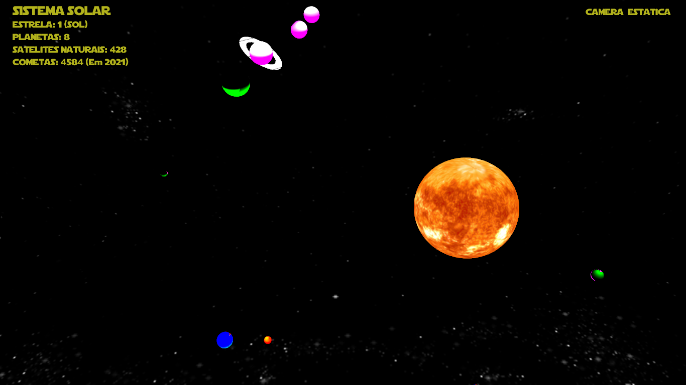
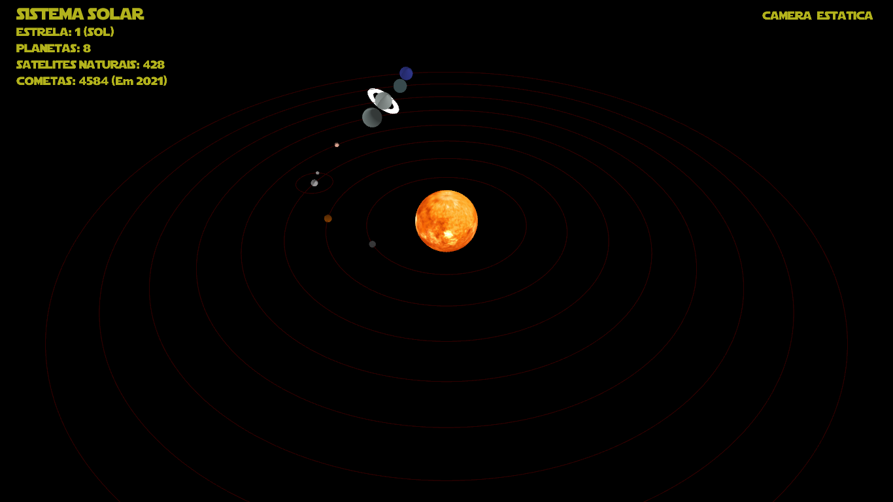

# Projeto Sistema Solar 🌞🌍🪐

Bem-vindo ao projeto Sistema Solar! Neste repositório, você encontrará um projeto interativo que simula o Sistema Solar, permitindo explorar os planetas, suas órbitas e informações interessantes sobre cada um deles.

## Funcionalidades

- **Exploração Planetária:** Navegue pelo Sistema Solar e conheça detalhes fascinantes sobre os planetas.
- **Órbitas Animadas:** Observe as órbitas realistas dos planetas ao redor do Sol.
- **Informações Detalhadas:** Descubra fatos interessantes sobre cada planeta, como composição, temperatura e tamanho.

## Tecnologias Utilizadas

- Linguagens: HTML, CSS e JavaScript.
- Biblioteca: Three.js para renderização 3D.

## Como Executar o Projeto

1. Clone este repositório em sua máquina local.
2. Abra o arquivo `index.html` em seu navegador.

## Parte 02 do projeto
Continuação do Projeto Sistema Solar, agora com adição de incríveis efeitos de iluminação! Nesta etapa, a equipe enfrentou desafios empolgantes, superando obstáculos técnicos e explorando os limites da computação gráfica para criar uma experiência ainda mais imersiva.

## 🌟 Dificuldades Encontradas pela Equipe

Durante o desenvolvimento do projeto, a equipe enfrentou algumas dificuldades, incluindo:

- **Manipulação das Bibliotecas do OpenGL:** A utilização das bibliotecas do OpenGL apresentou um desafio significativo devido à natureza complexa da computação gráfica. A equipe teve que se aprofundar no conhecimento dessas bibliotecas para implementar corretamente os efeitos desejados.

- **Desenvolvimento da Iluminação:** A implementação da iluminação foi uma etapa desafiadora, com a equipe enfrentando bugs e problemas ao longo do processo. As dificuldades surgiram principalmente na manipulação da luz difusa, ambiente e especular, afetando a aparência da cena.

- **Compatibilidade com Linux:** Houve dificuldade na execução do programa em sistemas operacionais Linux, uma vez que o Visual Studio é uma ferramenta da Microsoft voltada principalmente para Windows e Mac. A equipe precisou encontrar soluções alternativas para garantir que o projeto fosse executado corretamente nesses ambientes.

## 🚀 Demonstração

Confira a demonstração atualizada do projeto [aqui](link-para-demonstracao) e mergulhe em uma experiência deslumbrante de exploração espacial com efeitos de iluminação incríveis!

## 🌌 Imagens de Teste

A equipe realizou diversos testes para aprimorar a experiência visual do projeto. Confira algumas imagens abaixo:

## 🤝 Contribuição

Contribuições são sempre bem-vindas! Se você tem ideias para melhorar o projeto Sistema Solar Luz, sinta-se à vontade para enviar um pull request com suas alterações.

*Keep exploring the stars!* ✨🌟✨
